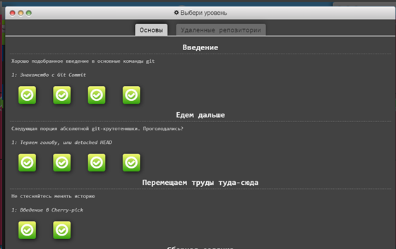
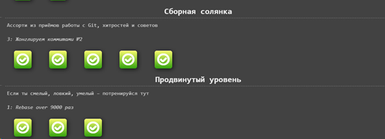
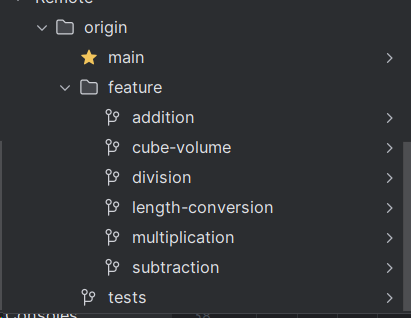
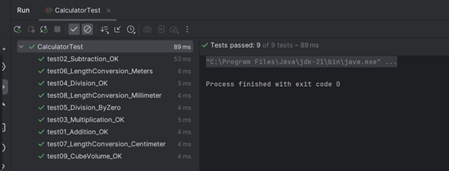

# Lab Work Report №1

## Course: "Mobile Application Programming"
### Topic: Exploring Version Control System GIT and Setting Up a Java/Kotlin Developer Environment

### Prepared by:
- BABACHANAKH Kateryna, VERNER Anastasiia 
- group 6.04.122.010.21.2
  
## Purpose of the Work:
- Learn how to set up the environment for a Java/Kotlin developer.
- Study the basics of using the GIT version control system.

## Steps of the Work

### Task 0:
Completed the GIT training course. Below are the screenshots of the completed levels:

- Levels passed:
  - 
  - 
  - 
 
### Task 2:

A basic calculator was created with the main functions (+, -, /, *) and a custom task according to the variant. A function for length conversion (meter, centimeter, millimeter) and cube volume calculation was also implemented.

- All project branches:
  
  

Each function of the program was implemented in a corresponding branch.

Tests were created to verify the program's functionality:

  

## Conclusion
During the lab work, we learned how to set up a Java/Kotlin developer environment and work with the GIT version control system. A program with several mathematical operations was created, and tests were implemented to verify its functionality.
